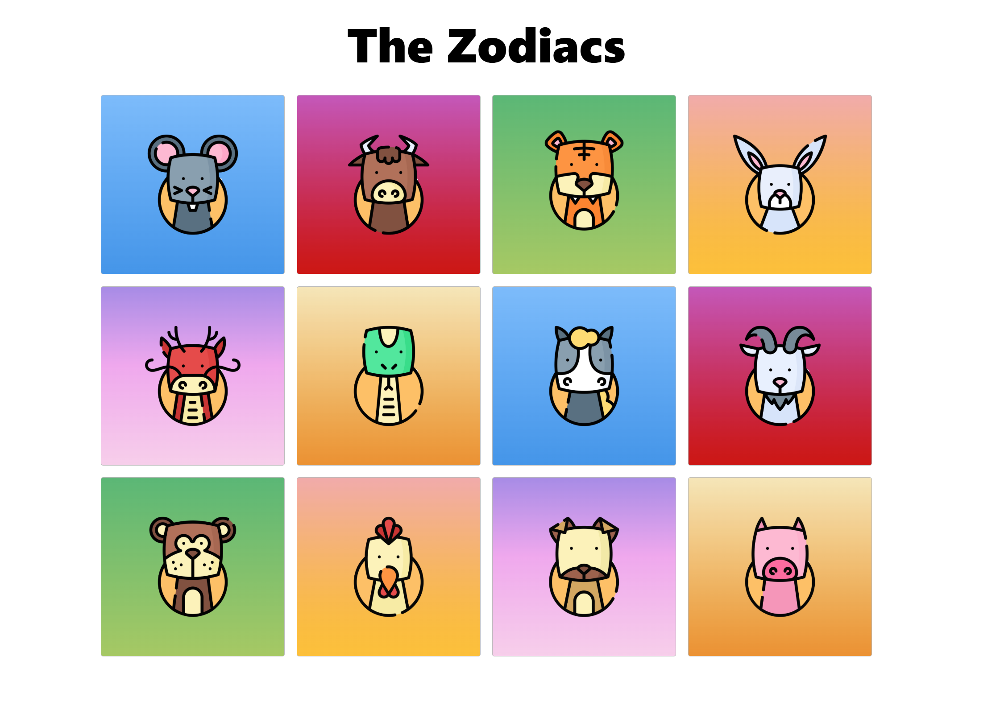

# The Zodiacs

  	

This page was created to experiment with CSS Grid and responsive layouts. It's a simple project, but useful for practice. Try hovering over the Zodiac animals to see the effects. If you're interested in the tests, check out the documentation.

- [Using CSS Grid](https://joseeden.github.io/joeden/docs/Software-Engineering/Web-Development/CSS-Grid/#making-it-responsive)

You can also explore:

- [Live Demo](https://superlative-sorbet-87fc0e.netlify.app/) 

Screenshot:

